# 🚀 My Portfolio

Welcome to my portfolio! Here are some of the projects I've worked on.

---

## 🌟 Featured Projects

### 1️⃣ Wallet App

**Description:** A mobile payment app which allows users to add their credit cards, make transfers and track the transactions.

**Tech Stack:** React Native, Expo, TypeScript, JavaScript, etc.

**Key Features:**  
✅ Displaying credit cards and their balances.  
✅ Transfer of funds to contacts.  
✅ Keeping track of transactions.

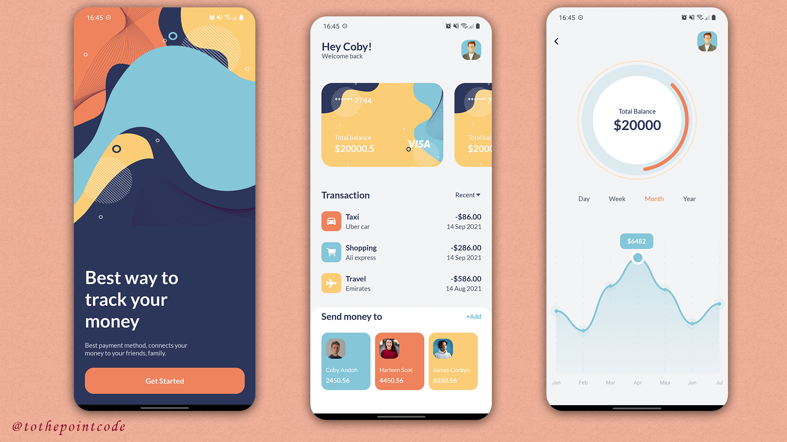

🔗 [Demo Video](https://www.youtube.com/watch?v=pwpaEENFdTo) |
🔗 [Project Tutorial](https://youtu.be/68l7wyHw97Y) | 🔗 [GitHub Repo](https://github.com/tothepointcode/stunning-waffle)

### 2️⃣ Agro Supply Chain

**Description:** A mobile app to connect farmers and consumers in a digital marketplace for buying and selling agricultural produce.

**Tech Stack:** React Native, Expo, JavaScript, Google Maps API etc.

**Key Features:**  
✅ Products listings and price adjustment.  
✅ Adding to cart and order management.  
✅ Mobile money payment integration on checkout.  
✅ Consumed APIs to make it functional.  
✅ Published on the Apple App Store.  
✅ Support for dark and light theme.

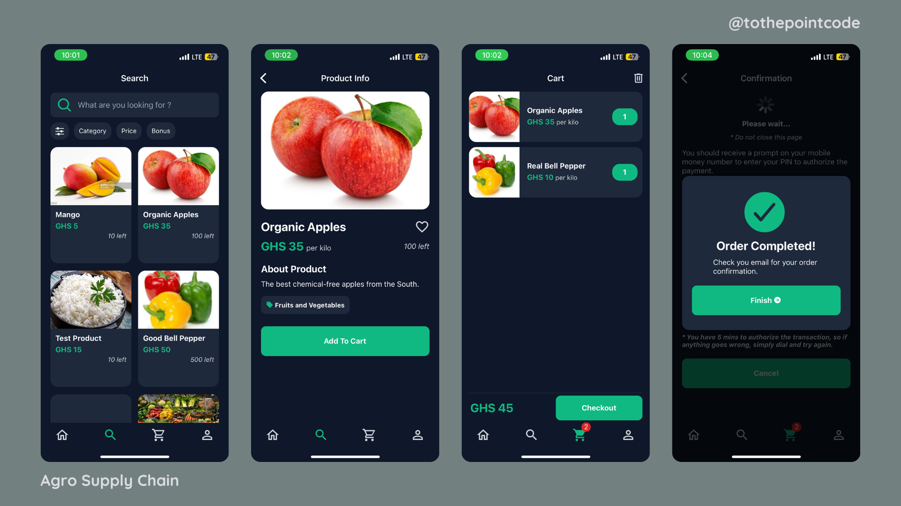  
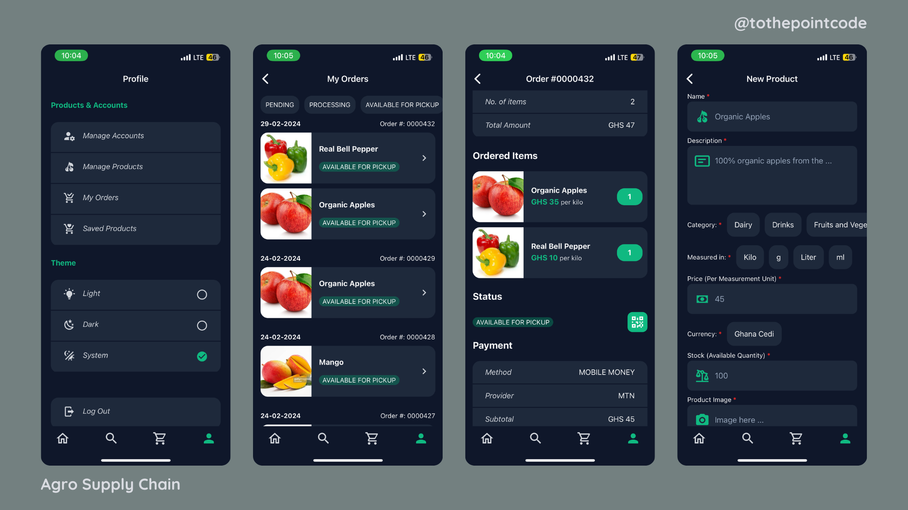

🔗 [Demo Video](https://youtu.be/_Tk2A2vFlcA) | 🔗 [App Store Link](https://apps.apple.com/us/app/agro-supply-chain/id6455085520)

### 3️⃣ Wine Shop

**Description:** A mobile app for the retail of wine.

**Tech Stack:** React Native, Expo, JavaScript, etc.

**Key Features:**  
✅ App onboarding to introduce app to user.  
✅ Listing of products with frontend search.   
✅ Adding products to cart and saving to wishlist.  
✅ App Icon and splashscreen added for a nice touch and branding.

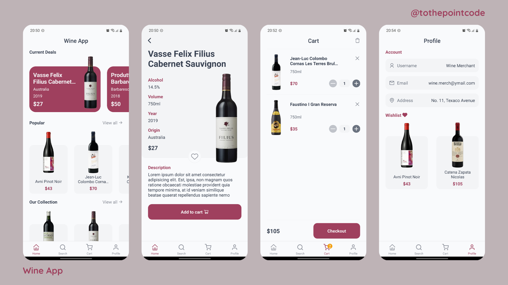

🔗 [Demo Video](https://youtube.com/shorts/j_XiD6ukQK0) |
🔗 [Project Tutorial](https://www.youtube.com/playlist?list=PLk8gdrb2DmChfFOK64d1A6D4KFPfz48yD)

### 4️⃣ E-Tickets App

**Description:** A mobile app which allows the buying and selling of electronic event tickets, preventing fraudulent ticket sales with QR code event check-in.

**Tech Stack:** React Native, Expo, JavaScript, Google Maps API, etc.

**Key Features:**  
✅ Creating of events and uploading tickets for sale.  
✅ Event locations indicated with Google Maps.  
✅ QR code scanning implemented to confirm valid tickets.  
✅ Mobile money payment integrated for purchases.  
✅ App published on the Apple App Store.  

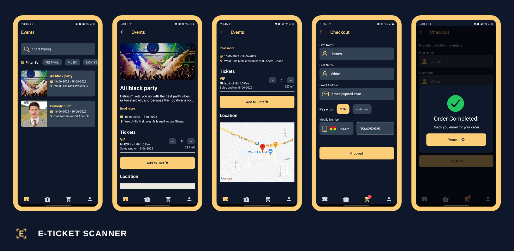

🔗 [App Store Link](https://apps.apple.com/us/app/e-ticket-scanner/id1629952771) |
🔗 [App Usage Video](https://youtu.be/yotjeyD-FKk)

### 5️⃣ Profile App

**Description:** A mobile app for displaying online courses with a focus on user profile image upload and management.

**Tech Stack:** React Native, Expo, JavaScript, Camera API, AsyncStorage, etc.

**Key Features:**  
✅ Online courses listing on homepage.  
✅ Profile image upload via Camera.  
✅ Profile image upload via Gallery.  
✅ Persistent storage to keep uploaded images on closing app.

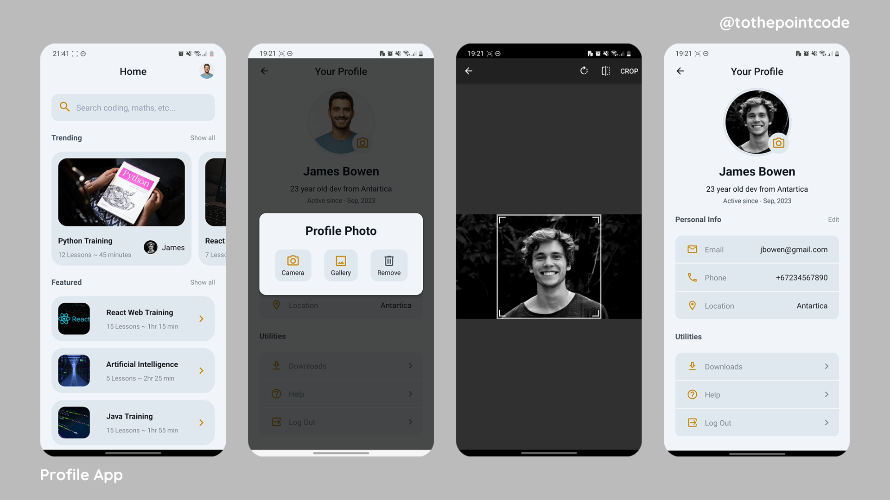

🔗 [Project Demo & Tutorial](https://youtu.be/uX5E_QFJubU)

### 6️⃣ Clean & Minimal Login App

**Description:** A multi-themed clean mobile app login user interfaces.

**Tech Stack:** React Native, Expo, TypeScript, JavaScript, etc.

**Key Features:**  
✅ Login and Signup pages.  
✅ Google and Facebook Single Sign-Ons.  
✅ Conditional credentials submit button.  
✅ Theme switch based on system theme.

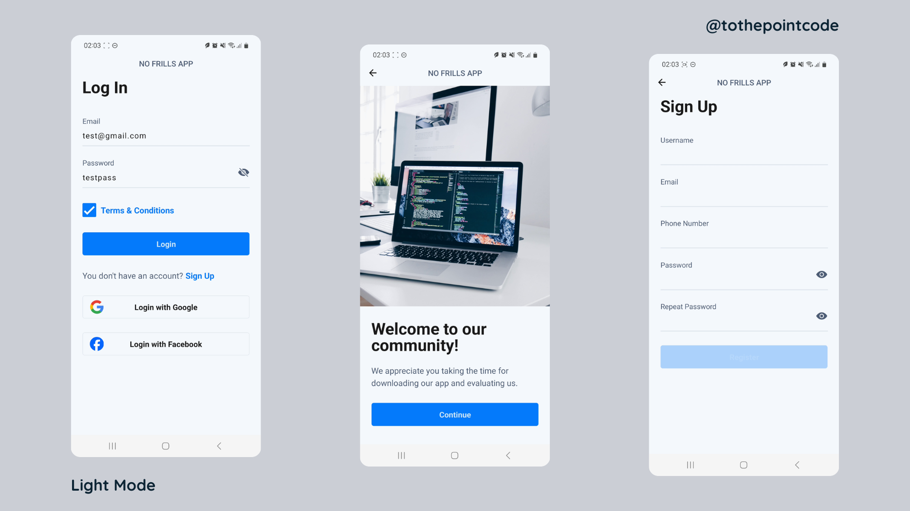  
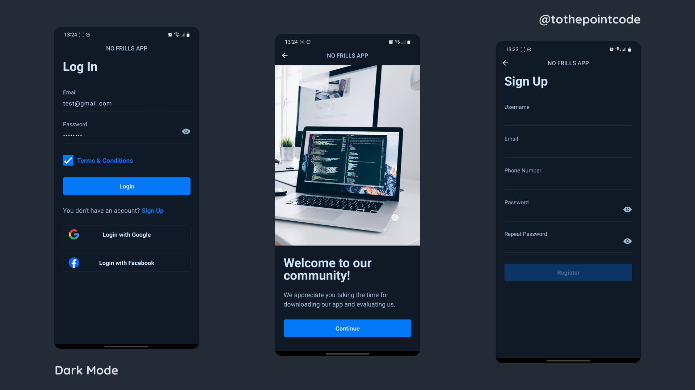

🔗 [Demo Video](https://youtube.com/shorts/Um0_UT8o1ZQ)

### 7️⃣ Flower Crib App

**Description:** A concept frontend app for full user authentication and account setup.

**Tech Stack:** React Native, Expo, JavaScript, DatePicker, Google Signin API, etc.

**Key Features:**  
✅ User account login and signup.  
✅ Signup with Google.   
✅ Persisting logged in user details on app restart.   
✅ User email verification via OTP and Link.   
✅ Backend API integration for the authentication.

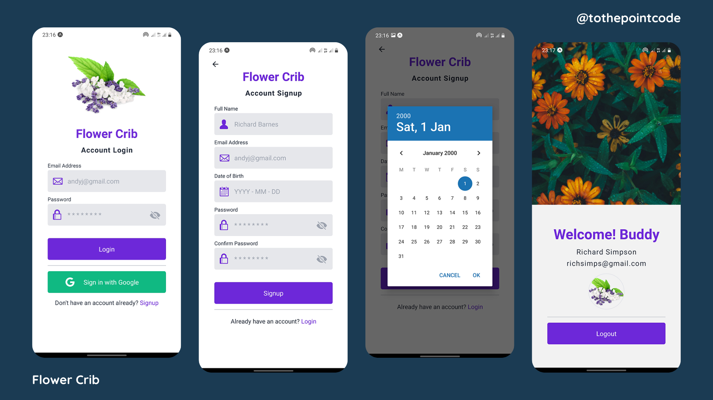  
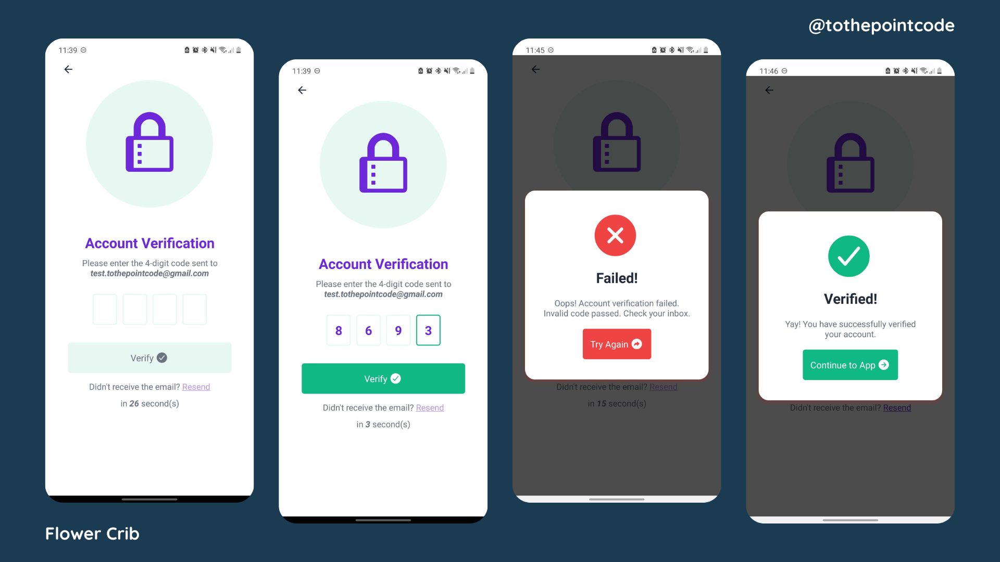

🔗 [Demo Video](https://youtube.com/shorts/8J8PkfToHrU) |
🔗 [Project Tutorial](https://www.youtube.com/playlist?list=PLk8gdrb2DmCicLTZJWC2cCTFXloTBMBCt) | 🔗 [Initial GitHub Repo](https://github.com/tothepointcode/flower-crib)

### 8️⃣ Sofa Shop

**Description:** A concept E-Commerce mobile application for retailing Sofa, cloned from a UI.

**Tech Stack:** React Native, Expo, JavaScript etc.

**Key Features:**  
✅ Product listings styled in steps.  
✅ Product details page with more information.   

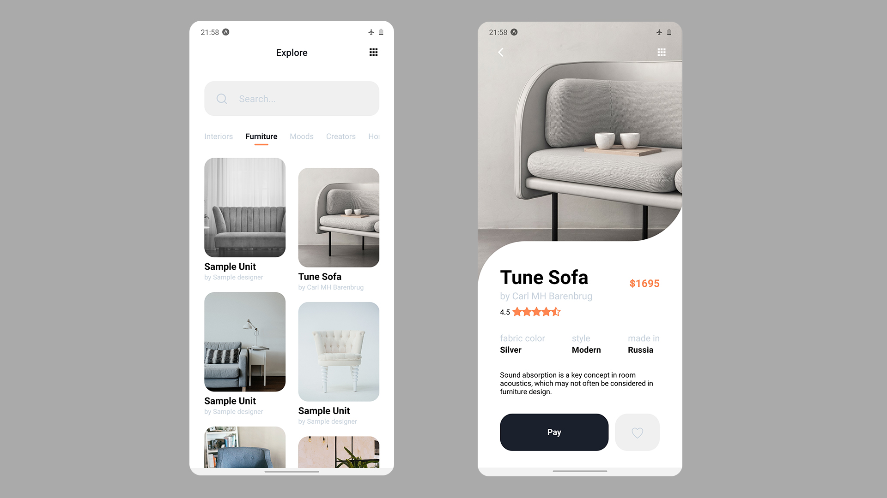

🔗 [GitHub Repo](https://github.com/tothepointcode/E-commerce-shop-UI)

### 9️⃣ Task List App

**Description:** An app for keeping track of tasks during the day. Allows grouping similar tasks into collections.

**Tech Stack:** React Native, Expo, JavaScript, Redux etc.

**Key Features:**  
✅ Tasks can be created, updated and removed when completed.  
✅ Collections can be created to house related tasks.  
✅ Progress bar to track number of transactions completed.  
✅ Dark theme support.  

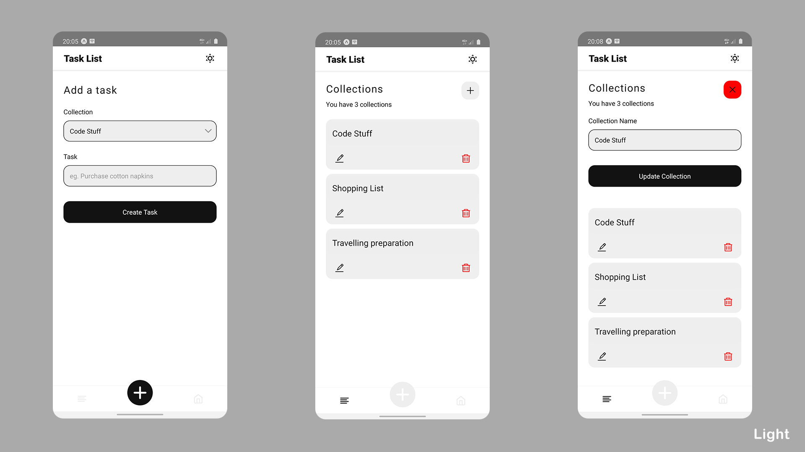  
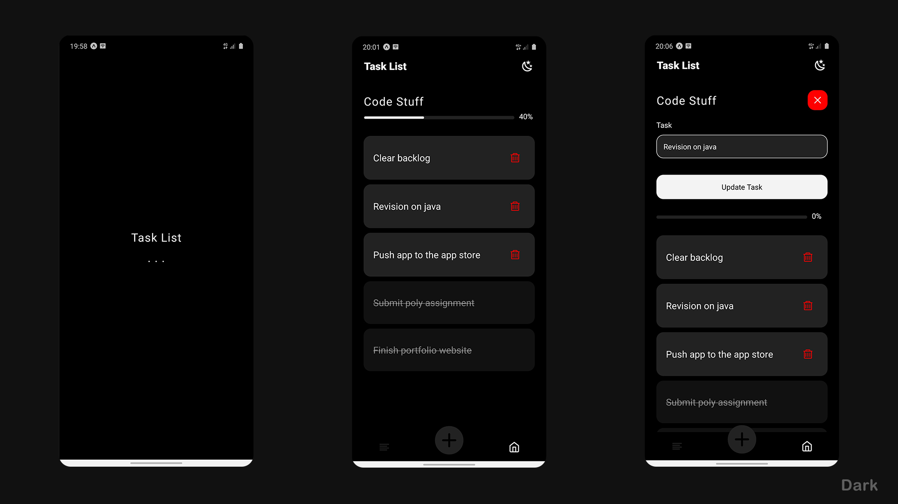

🔗 [GitHub Repo](https://github.com/tothepointcode/task_list_app)

### 🔟 Telly

**Description:** A movie listing website, cloned from a UI.

**Tech Stack:** React, HTML, CSS, JavaScript, etc.

**Key Features:**  
✅ Movies listed in columns and rows.  
✅ Backend API integration to fetch movies.  
✅ Details page provides more information and links to related movies.

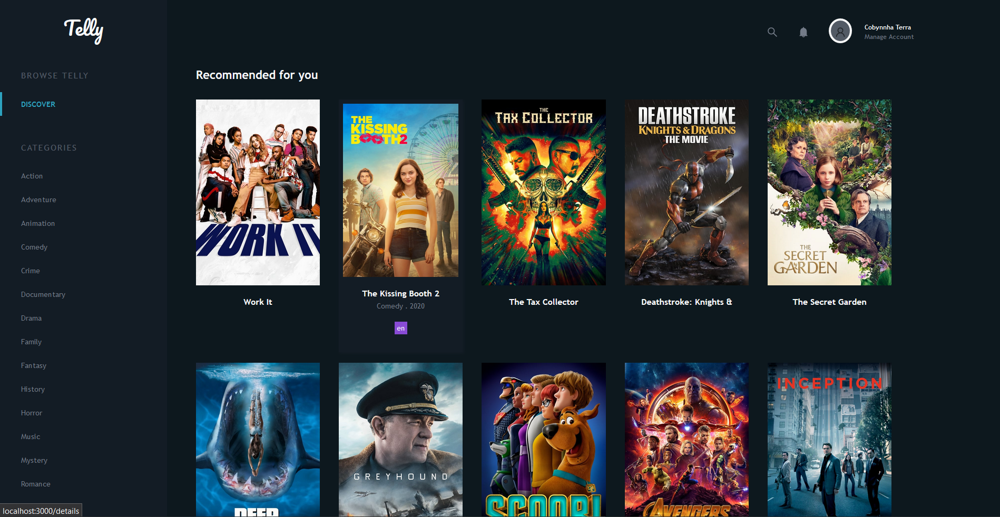
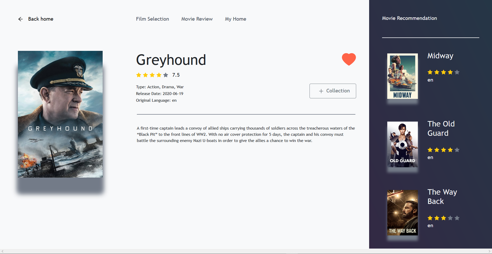

🔗 [Live App](https://goofy-montalcini-76e1e8.netlify.app/) |
🔗 [GitHub Repo](https://github.com/tothepointcode/baryonyx_telly)

### 📂 Other Projects

| Project Name | Tech Stack                     | Repo                                                                                 | Demo                                            |
| ------------ | ------------------------------ | ------------------------------------------------------------------------------------ | ----------------------------------------------- |
| Shoe Hub     | React Native, Expo, JavaScript | [GitHub](https://github.com/tothepointcode/shoeHub_UI)                               |                                                 |
| News Feed    | React Native, Expo, JavaScript | [Tutorial](https://www.youtube.com/playlist?list=PLk8gdrb2DmCjzB1eVRwobY9I_HLaZGPKv) | [Video](https://youtube.com/shorts/7Phx7DHBufI) |

---

## 📫 Contact Me

📧 **Email:** terra@tothepointcode.com   
🔗 **LinkedIn:** [Terra Andoh Baffoe](http://www.linkedin.com/in/terraandoh)  
📺 **YouTube:** [ToThePointCode](http://www.youtube.com/@ToThePointCode)

---
